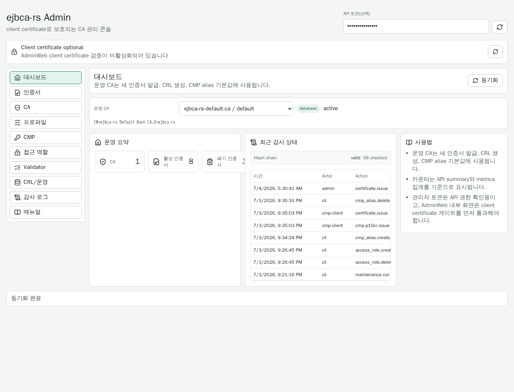
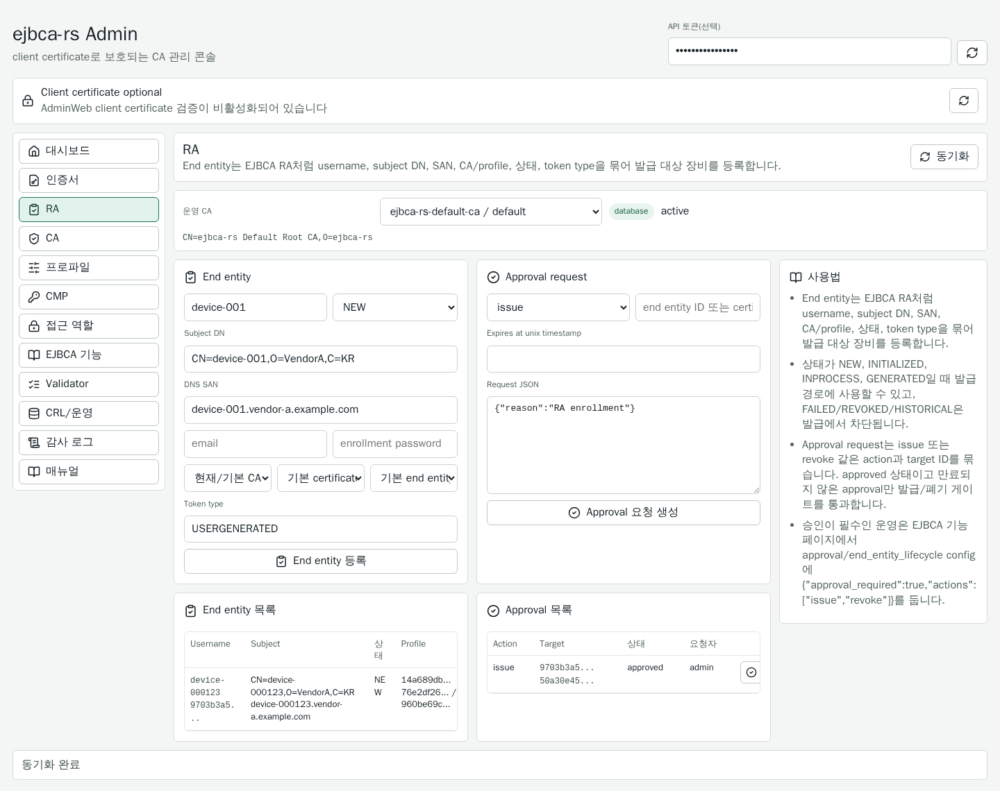
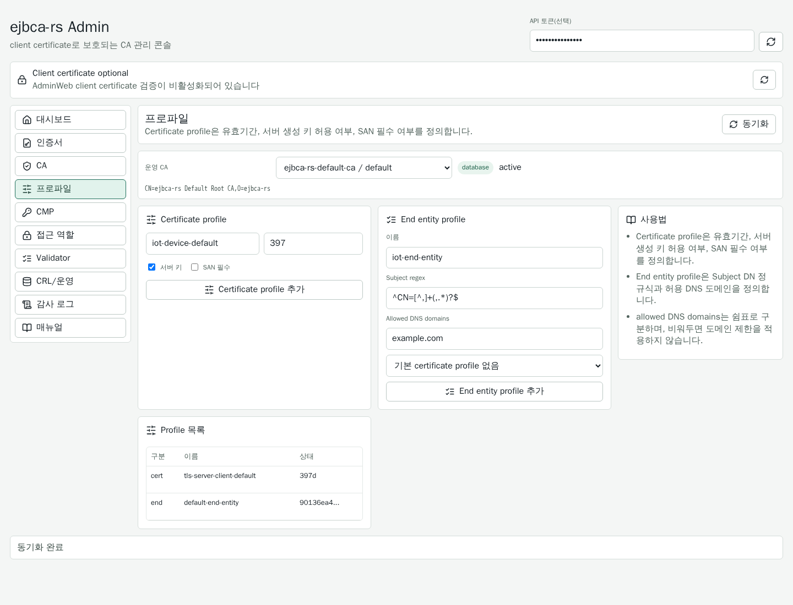
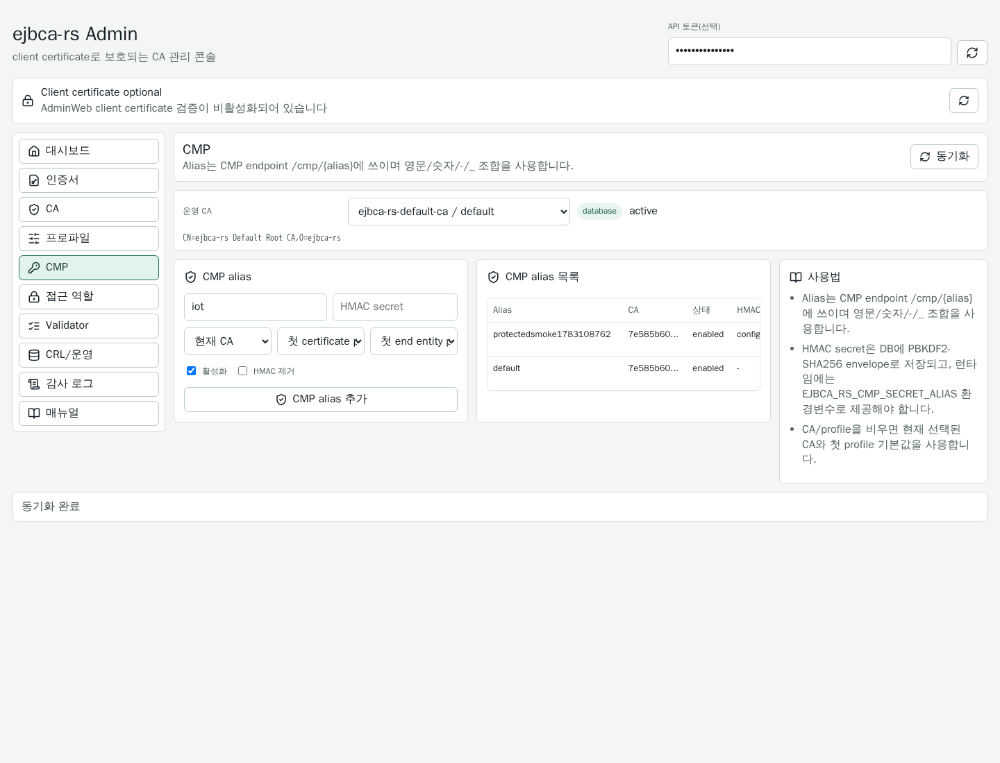
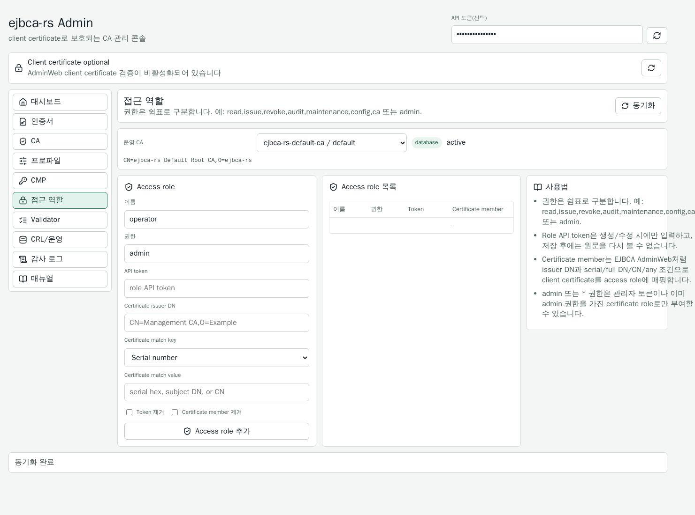
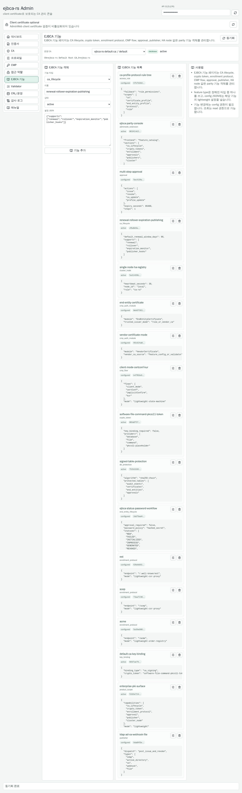
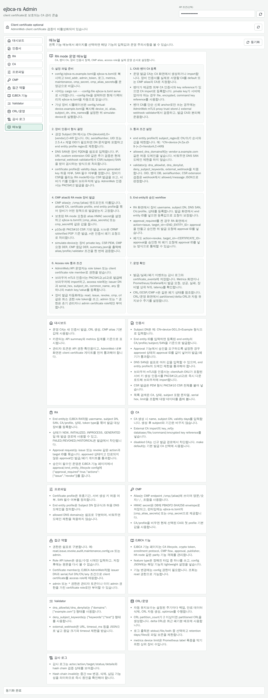

# ejbca-rs

Rust 백엔드와 React 프론트엔드로 구성한 경량 CA 운영 서버입니다. EJBCA의 CMP, OCSP, CRL, AdminWeb, DB maintenance, validator 흐름을 Rust 구조로 나누어 다시 구현하는 장기 프로젝트입니다.

현재 구현 범위와 EJBCA의 같은 점/다른 점은 [docs/ejbca-comparison.md](docs/ejbca-comparison.md)에 정리했습니다.

## EJBCA와 비교 요약

`ejbca-rs`는 EJBCA를 1:1로 대체하는 완전한 PKI 제품이 아니라, 장비 RA mode 발급과 운영 자동화에 필요한 핵심 기능을 Rust 단일 서버로 작게 구현한 프로젝트입니다. AdminWeb의 큰 메뉴 구조와 CA/profile/RA/CMP/access role 흐름은 EJBCA를 참고하지만, 내부 구현은 SQLite, Rust 서비스, React UI, 경량 설정 객체 중심으로 단순화했습니다.

### 비슷한 점

| 영역 | EJBCA와 비슷한 부분 |
| --- | --- |
| AdminWeb | 상단 기능 메뉴, CA 기능, RA 기능, 감독 기능, 시스템 설정처럼 EJBCA AdminWeb과 유사한 관리 흐름을 제공합니다. |
| CA 관리 | CA 생성, 외부 CA 등록, CA 상태 관리, renewal, rollover, CRL 생성 흐름을 제공합니다. |
| Profile | certificate profile과 end entity profile을 분리해 인증서 형식과 입력값 검증 정책을 따로 관리합니다. |
| RA mode | end entity 등록, approval request/decision, 장비별 subject/SAN/profile 고정 흐름을 제공합니다. |
| CMP | alias 기반 endpoint, HMAC/PBM 보호, p10cr/ir/cr/kur/certConf/rr 중심의 장비 발급 흐름을 제공합니다. |
| 접근 제어 | access role, role token, client certificate member 매핑으로 AdminWeb/API 권한을 제어합니다. |
| 운영 기능 | CRL, OCSP, 감사 로그, metrics, publisher, validator, maintenance 기능을 관리 화면/API/CLI로 제공합니다. |

### 다른 점

| 영역 | EJBCA | ejbca-rs |
| --- | --- | --- |
| 제품 범위 | 엔터프라이즈 PKI 전체 제품군입니다. | 장비 RA mode와 경량 CA 운영에 초점을 둔 프로젝트입니다. |
| 실행 구조 | Java/Jakarta EE, application server, 대형 모듈 구조를 사용합니다. | Rust 단일 프로세스와 React 정적 AdminWeb을 사용합니다. |
| 저장소 | 여러 운영 DB와 EJBCA 엔티티 모델을 지원합니다. | 현재는 SQLite 중심이며 대량 조회용 인덱스를 직접 최적화합니다. |
| HSM/crypto token | EJBCA의 성숙한 crypto token/HSM 관리 모델을 사용합니다. | DB/file/encrypted/command signer 방식의 경량 key provider를 제공합니다. |
| AdminWeb | 기능별 화면이 매우 넓고 세밀합니다. | EJBCA식 메뉴를 참고하되, 처음 보는 운영자가 따라 하기 쉽도록 도움말/작업 순서를 더 크게 노출합니다. |
| Protocol | CMP/EST/SCEP/ACME 등 폭넓은 표준 구현을 제공합니다. | CMP 핵심 RA mode와 EST/SCEP/ACME lightweight CSR proxy를 우선 제공합니다. |
| Access rule | 세밀한 권한 모델과 리소스 트리를 제공합니다. | role permission에 더해 actor/action/CA/profile/protocol scope 제약을 경량 기능 객체로 제공합니다. |
| Clustering | 검증된 HA/cluster 운영 기능을 제공합니다. | cluster node heartbeat와 HA 정책 객체를 제공하지만, 완전한 EJBCA cluster 대체는 아닙니다. |

### 장점과 한계

| 구분 | 내용 |
| --- | --- |
| 장점 | 단일 바이너리로 띄우기 쉽고, 설정 파일과 CLI/API/AdminWeb 흐름이 단순합니다. |
| 장점 | 장비 발급에 필요한 CA/profile/validator/CMP alias/access role 경로가 분리되어 운영 실수를 줄이기 쉽습니다. |
| 장점 | Prometheus/Grafana metrics, 감사 hash chain, 로그 retention, DB maintenance 같은 운영 자동화 기능을 작게 포함합니다. |
| 장점 | React AdminWeb은 페이지별 컴포넌트와 공통 도움말 데이터로 분리되어 기능 설명과 UI 유지보수가 쉽습니다. |
| 한계 | EJBCA의 전체 PKI 기능, 모든 enrollment protocol 세부 옵션, 검증된 엔터프라이즈 HA 기능을 대체하지 않습니다. |
| 한계 | HSM/crypto token, access rule, publisher, approval은 EJBCA의 전체 모델보다 경량화된 parity 구현입니다. |
| 한계 | 현재 목표는 실제 운영 가능한 경량 CA/RA 기반을 만드는 것이며, 장기 보안 검증과 대규모 운영 검증은 별도로 필요합니다. |

## 현재 구현

- 기본 Root CA 자동 생성
- Certificate Authorities 생성/수정/조회/import API/AdminWeb/CLI
- TOML/JSON 설정 파일 기반 서버 시작과 CMP alias secret 설정
- CA private key provider: 기본 DB PEM 저장, 선택적 DB key 암호화, 파일 기반 key reference, HSM/KMS CLI/에이전트용 external command signer
- External command signer timeout, 하위 프로세스 정리, 서명 출력 크기 제한
- Certificate profile, end entity profile, CMP alias, access role 설정 API/AdminWeb/CLI
- RA end entity lifecycle과 approval request/decision workflow API/AdminWeb/CLI
- EJBCA parity 기능 객체 관리 API/AdminWeb/CLI: CA lifecycle, crypto token, key binding, enrollment protocol, CMP auth/flow, end entity lifecycle, access rule, approval, publisher, DB protection, cluster node, AdminWeb extension
- 인증서 발급/폐기, CRL, validator, DB maintenance CLI
- 서버 생성 키 기반 인증서 발급
- PKCS#10 CSR 기반 인증서 발급
- CA/status/serial/subject/만료 시각 기준 인증서 필터 조회
- 인증서 목록은 PEM/DER 제외 요약 응답, 개별 PEM/DER 다운로드 API/CLI 제공
- 발급 시 certificate profile/end entity profile 정책 적용
- 인증서 폐기와 폐기 상태 저장
- base/partitioned/delta CRL 생성, 저장, 다운로드
- maintenance worker 기반 active CA base/partitioned CRL 자동 생성과 최신 CRL 중복 생성 방지
- JSON OCSP 상태 조회
- OCSP POST/GET DER 요청 검증과 서명된 RFC 6960 BasicOCSPResponse
- 정상 OCSP DER 응답의 RFC 5019 스타일 짧은 HTTP cache header와 오류 응답 no-store 처리
- CMP HTTP envelope 수신, DER PKIMessage 파싱, PKIBody 타입 식별
- CMP PBM/HMAC message protection 검증
- CMP p10cr PKCS#10 요청을 CMP alias의 CA/profile 정책으로 실제 인증서 발급
- 테스트용 CMP p10cr 요청 생성/POST smoke CLI, 발급 후 rr 폐기 smoke CLI, protected PBM/HMAC 요청 지원
- 설정 파일을 사용하는 가상 RA 장비 발급 시뮬레이터
- CMP ir/cr CRMF 요청을 raVerified POP 기준으로 실제 인증서 발급
- CMP p10cr `CertRepMessage` DER 응답과 rr 인증서 폐기 `RevRepContent` DER 응답
- validator 생성/수정/삭제/활성화 설정 및 발급 전 검증
- SQLite 백업, 만료 인증서/CRL 삭제, 최적화 API
- 설정 파일/DB 설정 기반 주기적 DB maintenance 워커
- WAL 모드에서도 일관된 SQLite snapshot을 만드는 `VACUUM INTO` 기반 DB 백업
- 감사 로그 저장과 필터형 조회 API/AdminWeb/CLI
- 감사 로그 SHA-256 hash chain 무결성 검증 API/AdminWeb/CLI
- 인증서 발급/폐기 상태와 감사 이벤트의 DB transaction atomicity
- trace/tracing/debug/info/warn/warning/error 로그 레벨, stdout/file/both 출력, 파일 로그 보존 정책
- Prometheus/Grafana 연동용 `/metrics`와 발급 요청/성공/실패/장비별 상위 N개 집계
- 발급 latency Prometheus histogram과 Grafana dashboard 예시
- CA 상태별 count와 CA 인증서 만료 timestamp metrics
- EJBCA publisher parity: 발급/폐기 직후 webhook/file publisher dispatch와 감사 로그 기록
- EJBCA access rule parity: actor/action/CA/profile/protocol scope 기반 발급/폐기 추가 제약
- DB pool/busy timeout과 동시 발급 상한 설정
- 실제 발급 경로를 병렬 호출하는 CLI 동시 발급 load test
- duration 기반 CLI 장시간 발급 soak test
- 요청 body 크기 제한과 목록 조회 최대 limit 설정
- 대량 인증서/metrics/audit 조회와 purge 경로용 SQLite 복합/부분 인덱스
- 기본 CORS 비활성화, 명시적 Origin allowlist 설정
- 서버 생성 private key 응답 `no-store`와 DER/PEM/CRL/OCSP 다운로드 `nosniff` 보안 헤더
- React AdminWeb 기능별 페이지 분리, 페이지별 사용법 매뉴얼, client certificate 기반 내부 접근 게이트

## 실행

```bash
cd ejbca-rs
cp config/ejbca-rs.example.toml ejbca-rs.toml
$EDITOR ejbca-rs.toml
cargo run -- --config-file ejbca-rs.toml serve
```

주기적 DB maintenance는 명시적으로 켠 경우에만 실행됩니다.
설정 파일은 TOML을 기본으로 사용하고 `.json` 확장자는 JSON으로 읽습니다. `--config-file`을 생략하면 현재 디렉터리의 `ejbca-rs.toml`을 자동으로 사용합니다.
기존 환경변수는 호환용 fallback으로 남아 있지만, 운영 절차는 `config/ejbca-rs.example.toml`을 복사해 관리하는 방식을 기준으로 합니다.
이후 AdminWeb/API/CLI에서 저장한 DB 설정이 maintenance와 metrics 런타임 동작에 우선 적용됩니다.
로그 출력 대상, CORS처럼 프로세스 시작 시 결정되는 값은 저장은 가능하지만 응답의 `restart_required_fields`에 표시됩니다.

주요 시작 설정은 다음처럼 파일에 둡니다.

```toml
bind_addr = "127.0.0.1:8080"
data_dir = "./data"
admin_token = "change-this-admin-token"
public_base_url = "http://127.0.0.1:8080"
ca_key_provider = "database"
# ca_key_encryption_secret = "change-this-long-random-secret"

database_max_connections = 32
database_busy_timeout_seconds = 30
max_concurrent_issuance = 128
max_request_bytes = 100000
max_list_limit = 1000
cors_allowed_origins = "http://127.0.0.1:5173"

adminweb_client_cert_required = true
adminweb_client_cert_header = "x-admin-client-cert-pem"
adminweb_client_cert_proxy_secret = "proxy-shared-secret"

log_level = "debug"
log_output = "both"        # stdout | file | both
log_dir = "./data/logs"
log_retention_days = 14
log_retention_files = 30

metrics_enabled = true
metrics_public = false
metrics_device_limit = 100
metrics_event_retention_days = 90
audit_event_retention_days = 365

maintenance_enabled = true
maintenance_interval_seconds = 3600
maintenance_backup = true
maintenance_purge_expired_certificates = true
maintenance_purge_expired_crls = true
maintenance_purge_audit_events = false
maintenance_optimize = true
maintenance_generate_crls = true
maintenance_crl_validity_days = 7
maintenance_crl_partition_count = 1

cmp_secret = "cmp-shared-secret"

[cmp_alias_secrets]
iot-ra = "cmp-shared-secret"
vendor-a-ra = "vendor-a-shared-secret"
```

`EJBCA_RS_CORS_ALLOWED_ORIGINS`를 설정하면 React 개발 서버 같은 분리 origin에서 `GET/POST/PUT/DELETE` 관리 API를 호출할 수 있습니다. CORS preflight는 `x-admin-token`, `Authorization: Bearer`, `content-type`, `x-admin-client-cert-pem`, `x-adminweb-proxy-secret` 헤더를 허용합니다.

AdminWeb 내부 화면은 EJBCA AdminWeb처럼 기본적으로 client certificate 기반으로 막습니다. 첫 진입 HTML은 열리지만, React 내부 기능 페이지는 `/api/v1/adminweb/session`에서 검증된 client certificate가 있어야 렌더링됩니다. 인증서가 확인되면 access role의 certificate member 설정(issuer DN + serial/full DN/CN/any 조건)에 매칭되어야 실제 관리 API 권한을 얻습니다. 로컬 개발에서만 `EJBCA_RS_ADMINWEB_CLIENT_CERT_REQUIRED=false`로 끌 수 있습니다.

```bash
cargo run -- --config-file ejbca-rs.toml issue-browser-certificate \
  --subject-dn 'CN=admin,O=Example' \
  --dns-names admin.example.com \
  --pkcs12-password changeit \
  --friendly-name admin-browser \
  --output-file admin-browser.p12
```

프록시는 검증된 client certificate PEM을 URL-escaped 값으로 `x-admin-client-cert-pem`에 넣고, 같은 요청에 `x-adminweb-proxy-secret`을 넣어 백엔드가 직접 들어온 헤더 스푸핑을 거부하게 합니다.
초기 부트스트랩은 `admin_token` 설정 또는 CLI로 access role을 만들고, 운영 AdminWeb은 인증서 role member로 권한을 받는 구성이 기본입니다. 관리자 토큰은 AdminWeb mTLS 인증서를 대체하는 별도 로그인 토큰이 아니라 API/CLI/bootstrap fallback입니다.

브라우저에 넣을 AdminWeb 인증서는 EJBCA의 `p12/superadmin.p12`와 같은 PKCS#12 파일로 생성합니다. AdminWeb의 인증서 발급 화면에서 `.p12 다운로드`를 누르거나 CLI에서 다음처럼 생성합니다. 생성된 `.p12`에는 clientAuth 인증서, private key, 발급 CA 인증서가 포함됩니다.

이 파일을 Chrome/Edge/Safari/Firefox의 인증서 관리 화면에서 개인 인증서로 import한 뒤, 해당 인증서의 issuer DN과 serial/full DN/CN 조건을 access role certificate member에 등록합니다. 이후 `adminweb_client_cert_required = true`로 실행하면 브라우저가 접속 시 이 인증서를 제시하고, role 권한이 맞을 때 AdminWeb 관리 API가 열립니다.

## RA mode 장비 인증서 운영 가이드

아래 캡처는 AdminWeb에서 실제로 설정하는 화면입니다.









RA mode 운영은 "어떤 CA가 서명할지", "장비 인증서가 어떤 DN/SAN/확장 정책을 만족해야 하는지", "장비가 어느 CMP alias로 요청할지", "운영자가 어떤 조건으로 AdminWeb/API 권한을 얻을지"를 분리해서 고정하는 방식입니다.

### 1. CA와 벤더 CA 등록

- **운영 발급 CA**: 장비 인증서를 실제로 서명하는 CA입니다. AdminWeb `CA` 화면에서 생성하거나 CLI `create-ca`로 만듭니다.
- **벤더 CA**: 벤더가 제공한 CA key까지 서버가 사용해야 하면 `import-ca`로 등록합니다. 벤더 CA를 단순 신뢰 anchor로만 쓰는 경우에는 mTLS proxy trust store 또는 external webhook validator에서 검증하고, 발급 CA와 분리합니다.
- **HSM/KMS 사용**: 서버에 CA private key를 직접 보관하지 않으려면 `file:`, `encrypted:`, `command:` key reference를 사용합니다.

```bash
cargo run -- create-ca \
  --name iot-issuing-ca \
  --subject-dn 'CN=IoT Issuing CA,O=Example,C=KR' \
  --validity-days 3650

cargo run -- import-ca \
  --name vendor-a-ca \
  --cert-pem-file ./vendor-a-ca.pem \
  --key-ref 'file:/secure/vendor-a-ca-key.pem'

cargo run -- renew-ca \
  --id <CA_ID> \
  --validity-days 3650

cargo run -- rollover-ca \
  --id <CA_ID> \
  --name iot-issuing-ca-2026 \
  --validity-days 3650 \
  --make-default \
  --disable-old
```

### 2. 장비에게 내려줄 인증서 형식

장비 RA mode에서는 장비가 CSR 또는 CRMF 요청을 올리고 서버가 인증서를 내려줍니다.

| 경로 | 장비가 보내는 형식 | 서버가 내려주는 형식 | 용도 |
| --- | --- | --- | --- |
| CMP `p10cr` | PKCS#10 CSR이 들어간 PKIMessage DER | CMP `CertRepMessage` DER | 장비가 키를 직접 생성하는 일반 RA mode |
| CMP `ir/cr` | CRMF CertReqMessages, raVerified POP | CMP `CertRepMessage` DER | RA가 POP를 검증한 뒤 대리 요청 |
| CMP `kur` | CRMF CertReqMessages 갱신 요청 | CMP `kup` CertRepMessage DER | 기존 장비 인증서 갱신 |
| CMP `certConf` | 발급 확인 메시지 | CMP `pkiconf` DER | certConf를 쓰는 장비의 확인 ack |
| EST/SCEP/ACME lightweight CSR proxy | PEM 또는 DER PKCS#10 CSR | JSON + 인증서 PEM | 표준 전체 구현이 필요 없는 장비/게이트웨이 연동 |
| Admin/API `issue-csr` | PEM PKCS#10 CSR | JSON + 인증서 PEM, 개별 PEM/DER 다운로드 | 운영자 테스트 또는 수동 발급 |
| Admin/API `issue-pkcs12` | 서버 생성 key 요청 | PKCS#12 `.p12` | 브라우저 mTLS 관리자 인증서 |

권장 장비 인증서 DN 예시는 다음처럼 단순하고 검증 가능한 형태입니다.

```text
CN=device-000123,O=VendorA,C=KR
DNS SAN: device-000123.vendor-a.example.com
```

DN에 `OU`, `UID`, `serialNumber`, 커스텀 OID가 필요하면 장비 CSR에 포함시키고, end entity profile의 `subject_regex` 또는 external webhook validator에서 검사합니다.

### 3. Certificate profile과 end entity profile

`프로파일` 화면에서 두 정책을 만듭니다.

- **Certificate profile**: 유효기간, 서버 생성 key 허용 여부, SAN 필수 여부를 정합니다.
- **End entity profile**: Subject DN 정규식과 DNS SAN 허용 도메인을 정합니다.

예시 정책:

```bash
cargo run -- create-certificate-profile \
  --name iot-device-client \
  --validity-days 397 \
  --require-san

cargo run -- create-end-entity-profile \
  --name vendor-a-device \
  --subject-regex '^CN=device-[A-Za-z0-9-]+,O=VendorA,C=KR$' \
  --allowed-dns-domains vendor-a.example.com \
  --default-certificate-profile-id <CERT_PROFILE_ID>
```

현재 내장 검증은 `subject_regex`, `allowed_dns_domains`, `dns_allowlist`, `dns_denylist`, `deny_subject_keywords`입니다. 임의 OID, CSR extension, 벤더 장비 DB, serialNumber 중복 같은 검증은 `external_webhook` validator로 처리합니다. webhook에는 다음 데이터가 전달됩니다.

```json
{
  "phase": "pre_issue",
  "context": {
    "ca_id": "...",
    "subject_dn": "CN=device-000123,O=VendorA,C=KR",
    "dns_names": ["device-000123.vendor-a.example.com"],
    "csr_pem": "-----BEGIN CERTIFICATE REQUEST-----..."
  }
}
```

webhook은 허용 여부를 다음처럼 응답합니다.

```json
{"allowed": true, "message": "ok"}
```

### 4. End entity 등록과 approval workflow

EJBCA RA처럼 장비별 end entity를 먼저 등록하면 발급 요청에서 `end_entity_id`만 넘겨도 CA/profile/subject/SAN이 등록값으로 고정됩니다. CSR 발급에서는 CSR의 Subject DN과 DNS SAN이 등록된 end entity와 일치해야 통과합니다.

```bash
cargo run -- --config-file ejbca-rs.toml create-end-entity \
  --username device-000123 \
  --subject-dn 'CN=device-000123,O=VendorA,C=KR' \
  --dns-names device-000123.vendor-a.example.com \
  --ca-id <ISSUING_CA_ID> \
  --certificate-profile-id <CERT_PROFILE_ID> \
  --end-entity-profile-id <EE_PROFILE_ID> \
  --status NEW \
  --token-type USERGENERATED
```

발급이나 폐기에 승인이 필요하면 EJBCA 기능 페이지에서 approval 기능을 활성화하고, config에 필요한 action을 적습니다.

```bash
cargo run -- --config-file ejbca-rs.toml create-ejbca-feature \
  --feature-type approval \
  --name issue-revoke-approval \
  --status active \
  --config-json '{"approval_required":true,"actions":["issue","revoke"]}'
```

발급 승인 예시는 다음과 같습니다. `target_id`는 end entity ID를 사용합니다.

```bash
cargo run -- --config-file ejbca-rs.toml create-approval \
  --action issue \
  --target-id <END_ENTITY_ID> \
  --request-json '{"reason":"initial enrollment","device_id":"device-000123"}'

cargo run -- --config-file ejbca-rs.toml decide-approval \
  --id <APPROVAL_ID> \
  --status approved \
  --decision-json '{"approved_by":"ra-operator"}'

cargo run -- --config-file ejbca-rs.toml issue-certificate \
  --end-entity-id <END_ENTITY_ID> \
  --approval-id <APPROVAL_ID>
```

폐기 승인 예시는 `target_id`에 certificate ID를 넣습니다.

```bash
cargo run -- --config-file ejbca-rs.toml create-approval \
  --action revoke \
  --target-id <CERT_ID> \
  --request-json '{"reason":"key_compromise"}'

cargo run -- --config-file ejbca-rs.toml decide-approval \
  --id <REVOKE_APPROVAL_ID> \
  --status approved

cargo run -- --config-file ejbca-rs.toml revoke-certificate \
  --id <CERT_ID> \
  --reason key_compromise \
  --approval-id <REVOKE_APPROVAL_ID>
```

End entity 상태는 `NEW`, `INITIALIZED`, `INPROCESS`, `GENERATED`, `FAILED`, `REVOKED`, `HISTORICAL`을 사용합니다. `FAILED`, `REVOKED`, `HISTORICAL` 상태는 발급 경로에서 차단됩니다.

### 5. Validator로 CN/O/C/OID 통과 조건 만들기

검증 기준은 아래처럼 나눕니다.

| 검증 항목 | 권장 위치 | 예시 |
| --- | --- | --- |
| CN 형식 | end entity profile `subject_regex` | `CN=device-[A-Za-z0-9-]+` |
| O, C 고정값 | end entity profile `subject_regex` | `O=VendorA,C=KR` |
| DNS SAN 도메인 | end entity profile 또는 `dns_allowlist` | `vendor-a.example.com` |
| 금지 단어 | `deny_subject_keywords` | `test`, `sample`, `unknown` |
| 커스텀 OID/확장 | `external_webhook` | CSR PEM을 파싱해 OID 값 확인 |
| 벤더 DB/시리얼 검증 | `external_webhook` | deviceId가 등록된 장비인지 확인 |

예시:

```bash
cargo run -- create-validator \
  --name vendor-a-dns \
  --kind dns_allowlist \
  --config-json '{"domains":["vendor-a.example.com"]}'

cargo run -- create-validator \
  --name vendor-a-policy-webhook \
  --kind external_webhook \
  --config-json '{"url":"https://ra-policy.example.com/validate","token":"shared-token","timeout_ms":3000}'
```

### 6. CMP alias 등록

`CMP` 화면의 alias는 장비가 호출하는 URL `/cmp/{alias}`입니다. alias에는 발급 CA, certificate profile, end entity profile, HMAC secret을 묶습니다.

```bash
cargo run -- create-cmp-alias \
  --alias vendor-a-ra \
  --ca-id <ISSUING_CA_ID> \
  --certificate-profile-id <CERT_PROFILE_ID> \
  --end-entity-profile-id <EE_PROFILE_ID> \
  --hmac-secret 'vendor-a-shared-secret'
```

서버가 보호된 CMP 요청을 검증할 수 있도록 `ejbca-rs.toml`에도 같은 secret을 넣습니다. DB에는 secret 원문이 아니라 검증용 hash만 저장되므로, 런타임 설정 파일의 secret이 반드시 필요합니다.

```toml
[cmp_alias_secrets]
vendor-a-ra = "vendor-a-shared-secret"
```

벤더 CA가 검증한 RA/client 인증서로 alias 접근을 허용하려면 TLS 종료 프록시에서 client certificate를 검증하고 PEM을 header로 전달합니다. `cmp_auth_module` 기능 객체는 이 header의 subject/issuer/fingerprint와 proxy secret을 검사합니다. 이 방식은 CMP PKIMessage signature 검증이 아니라, mTLS proxy 기반 EndEntityCertificate/vendor certificate mode입니다.

```bash
cargo run -- --config-file ejbca-rs.toml create-ejbca-feature \
  --feature-type cmp_auth_module \
  --name vendor-a-client-cert \
  --status active \
  --config-json '{
    "rules":[{
      "module":"vendor_certificate",
      "aliases":["vendor-a-ra"],
      "client_cert_header":"x-cmp-client-cert-pem",
      "proxy_secret_header":"x-cmp-proxy-secret",
      "proxy_secret":"change-this-proxy-secret",
      "allowed_issuer_dns":["CN=Vendor A Root CA,O=VendorA,C=KR"],
      "allowed_subjects":["CN=vendor-a-ra,O=VendorA,C=KR"]
    }]
  }'
```

장비는 다음 정책으로 통과해야 합니다.

- CMP message protection이 있으면 alias secret으로 PBM/HMAC 검증을 통과해야 합니다.
- `cmp_auth_module` vendor certificate rule이 alias에 적용되면 TLS proxy가 전달한 client certificate header와 proxy secret이 rule을 통과해야 합니다.
- alias가 가리키는 CA가 `active`여야 합니다.
- CSR/CRMF에서 추출한 DN/SAN이 end entity profile과 validator를 통과해야 합니다.
- profile에서 SAN 필수인 경우 DNS SAN이 있어야 합니다.

CMP wire protocol이 필요 없는 게이트웨이는 같은 CMP alias를 enrollment alias로 재사용해 경량 CSR proxy endpoint를 호출할 수 있습니다. 세 endpoint는 표준 EST/SCEP/ACME 전체 상태머신이 아니라, alias의 CA/profile/validator/access_rule을 공유하는 CSR 발급 경로입니다.

```bash
curl -X POST http://127.0.0.1:8080/est/vendor-a-ra/simpleenroll \
  -H 'content-type: application/pkcs10' \
  --data-binary @device.csr.der

curl -X POST http://127.0.0.1:8080/scep/vendor-a-ra/pkcsreq \
  -H 'content-type: application/octet-stream' \
  --data-binary @device.csr.der

curl -X POST http://127.0.0.1:8080/acme/vendor-a-ra/finalize \
  -H 'content-type: application/pkcs10' \
  --data-binary @device.csr.der
```

### 7. 가상 RA 장비로 발급 시뮬레이션

`config/virtual-device.example.toml`을 복사해 장비별 설정을 만듭니다.

```bash
cp config/virtual-device.example.toml vendor-a-device-000123.toml
$EDITOR vendor-a-device-000123.toml
```

예시:

```toml
device_id = "device-000123"
server_url = "http://127.0.0.1:8080"
alias = "vendor-a-ra"
subject_dn = "CN=device-000123,O=VendorA,C=KR"
dns_names = ["device-000123.vendor-a.example.com"]
output_dir = "./data/simulated-devices/device-000123"
```

서버를 실행한 상태에서 다른 터미널에서 실행합니다.

```bash
cargo run -- --config-file ejbca-rs.toml simulate-device \
  --device-config vendor-a-device-000123.toml
```

시뮬레이터는 장비 private key, CSR PEM, CMP 요청 DER, CMP 응답 DER, `summary.json`을 출력 디렉터리에 저장합니다. `summary.json`의 `issued_serial_hexes`에 발급 serial이 있으면 alias secret, DN/SAN profile, validator 조건을 통과한 것입니다.

### 8. Access role 통과 조건

운영자와 자동화 클라이언트는 access role 권한을 만족해야 관리 API를 호출할 수 있습니다.

| 접근 주체 | 권장 인증 | Role member 조건 |
| --- | --- | --- |
| 초기 관리자 | `admin_token` | bootstrap 전용 |
| AdminWeb 브라우저 사용자 | PKCS#12 client certificate | issuer DN + `serial_hex` 또는 `subject_dn` |
| 장비 발급 자동화 | role API token | `read,issue,cmp` 등 최소 권한 |
| 폐기 자동화 | role API token | `read,revoke,crl` |
| 감사/운영 조회 | role API token 또는 admin cert | `read,audit,maintenance` |

AdminWeb mTLS 인증서 role 예시:

```bash
cargo run -- create-access-role \
  --name admin-browser \
  --permissions admin \
  --certificate-issuer-dn 'CN=IoT Issuing CA,O=Example,C=KR' \
  --certificate-match-key serial_hex \
  --certificate-match-value '<ADMIN_CERT_SERIAL_HEX>'
```

장비 발급 자동화 token 예시:

```bash
cargo run -- create-access-role \
  --name vendor-a-ra-client \
  --permissions read,issue,cmp \
  --api-token '<LONG_RANDOM_TOKEN>'
```

세밀한 CA/profile/protocol scope는 EJBCA 기능의 `access_rule` 객체로 제한합니다. 기존 access role permission이 1차 권한이고, `access_rule`은 그 위에 범위를 좁히는 추가 제약입니다.

```bash
cargo run -- --config-file ejbca-rs.toml create-ejbca-feature \
  --feature-type access_rule \
  --name vendor-a-issue-scope \
  --status active \
  --config-json '{
    "mode":"allowlist",
    "rules":[{
      "effect":"allow",
      "actors":["role:vendor-a-ra-client","cert-role:admin-browser"],
      "actions":["issue","revoke"],
      "protocols":["admin_api","cmp"],
      "ca_ids":["<ISSUING_CA_ID>"],
      "certificate_profile_ids":["<CERT_PROFILE_ID>"],
      "end_entity_profile_ids":["<EE_PROFILE_ID>"]
    }]
  }'
```

`mode: "allowlist"` 또는 `default: "deny"`를 설정하면 매칭되는 allow rule이 없는 요청은 차단됩니다. `effect: "deny"` rule은 allow보다 우선합니다. actor 값은 `role:<name>`, `cert-role:<name>`, `cert-role-admin:<name>`, `cmp-client`, `admin` 또는 role 이름만 쓸 수 있습니다.

### 9. 운영 확인

- `감사 로그` 화면에서 `certificate.issue`, `certificate.revoke`, `cmp_alias.*`, `access_role.*` 이벤트를 확인합니다.
- `/metrics`와 Grafana dashboard에서 발급 요청/성공/실패, 장비별 상위 N개, latency histogram, CA 상태와 만료 시각을 확인합니다.
- `CRL/운영` 화면에서 base/partitioned/delta CRL 생성, 자동 유지보수, 로그 보존, audit/metric event 보존 기간을 설정합니다.
- `EJBCA 기능` 화면에서 `publisher` 기능을 `webhook` 또는 `file` type으로 설정하면 발급/폐기 직후 외부 시스템으로 이벤트가 전달됩니다.

Publisher 예시:

```bash
cargo run -- --config-file ejbca-rs.toml create-ejbca-feature \
  --feature-type publisher \
  --name file-audit-publisher \
  --status active \
  --config-json '{"type":"file","path":"./data/publisher-events.ndjson","events":["issue","revoke"]}'

cargo run -- --config-file ejbca-rs.toml create-ejbca-feature \
  --feature-type publisher \
  --name webhook-publisher \
  --status active \
  --config-json '{"type":"webhook","url":"https://publisher.example.com/certificates","token":"shared-token","timeout_ms":3000,"events":["issue","revoke"]}'
```

`required`, `fail_closed`, `block_on_failure` 중 하나를 `true`로 두면 해당 publisher 실패를 발급/폐기 오류로 전파합니다. 기본값은 감사 로그에 실패를 기록하고 운영 흐름은 계속 진행하는 방식입니다.

CA key provider 설정 예시:

```toml
ca_key_provider = "file"  # database | file
ca_key_dir = "./data/keys"
```

DB provider를 쓰면서 CA private key를 DB에 암호화해 저장하려면 다음 secret을 설정합니다.
기존 plaintext DB key는 계속 읽을 수 있고, secret 설정 이후 새로 생성되는 DB provider CA key와 `build-encrypted-key-ref` 출력만 암호화됩니다.

```bash
cargo run -- --config-file ejbca-rs.toml build-encrypted-key-ref --key-pem-file ./external-ca-key.pem
```

```toml
ca_key_provider = "database"
ca_key_encryption_secret = "change-this-long-random-secret"
```

외부 signer CA import 예시:

```bash
KEY_REF=$(cargo run -- --config-file ejbca-rs.toml build-command-key-ref \
  --command /opt/hsm/kms-sign \
  --args-json '["--key-id","ca-key-1"]' \
  --timeout-ms 5000 \
  --max-output-bytes 8192)

cargo run -- --config-file ejbca-rs.toml import-ca \
  --name external-ca \
  --cert-pem-file ./external-ca.pem \
  --key-ref "$KEY_REF"
```

CMP alias HMAC secret은 DB에 원문을 저장하지 않고 salt가 포함된 PBKDF2-SHA256 envelope로 저장합니다.
기존 단순 SHA-256 저장값은 업그레이드 호환을 위해 계속 검증할 수 있습니다.
보호된 CMP 요청을 처리하려면 실행 환경에 alias별 secret을 함께 설정해야 합니다.

```bash
cargo run -- create-cmp-alias --alias iot-prod --ca-id <CA_ID> --hmac-secret 'shared-secret'
```

```toml
[cmp_alias_secrets]
iot-prod = "shared-secret"
```

CMP p10cr smoke 예시:

```bash
cargo run -- --config-file ejbca-rs.toml cmp-p10cr-smoke \
  --server-url http://127.0.0.1:8080 \
  --alias iot-prod \
  --subject-dn 'CN=device-cmp-001,O=Example' \
  --dns-names device-cmp-001.example.com \
  --hmac-secret 'shared-secret' \
  --request-der-file /tmp/cmp-p10cr.req.der \
  --response-der-file /tmp/cmp-p10cr.resp.der
```

CMP 발급 후 rr 폐기 smoke 예시:

```bash
cargo run -- --config-file ejbca-rs.toml cmp-issue-revoke-smoke \
  --server-url http://127.0.0.1:8080 \
  --alias iot-prod \
  --subject-dn 'CN=device-cmp-rr-001,O=Example' \
  --dns-names device-cmp-rr-001.example.com \
  --hmac-secret 'shared-secret'
```

Prometheus scrape 예시:

```bash
curl -H "Authorization: Bearer <ADMIN_TOKEN_OR_READ_ROLE_TOKEN>" \
  http://127.0.0.1:8080/metrics
```

Prometheus/Grafana 예시는 다음 파일을 사용할 수 있습니다.

```bash
docs/observability/prometheus.yml
docs/observability/grafana-dashboard.json
```

`EJBCA_RS_METRICS_PUBLIC=false`인 기본 설정에서는 Prometheus `authorization.credentials`에 관리자 토큰이나 `read` 권한 access role token을 넣습니다.

React UI를 개발 모드로 볼 때:

```bash
cd ejbca-rs/web
npm install
npm run dev
```

서버가 정적 빌드를 직접 제공하게 하려면:

```bash
cd ejbca-rs/web
npm install
npm run build
cd ..
cargo run
```

주요 검증 명령:

```bash
cargo test
cargo test certs::service::tests
npm run build --prefix web
```

CLI 설정 예시입니다. 설정 파일을 쓰는 경우 전역 옵션은 subcommand 앞에 둡니다.

```bash
cargo run -- --config-file ejbca-rs.toml list-cas
cargo run -- build-command-key-ref --command /opt/hsm/kms-sign --args-json '["--key-id","ca-key-1"]' --timeout-ms 5000 --max-output-bytes 8192
cargo run -- build-encrypted-key-ref --key-pem-file ./external-ca-key.pem
cargo run -- --config-file ejbca-rs.toml cluster-heartbeat --node-id ca-node-a --role ra-ca --status up --metadata-json '{"zone":"az-a"}'
cargo run -- --config-file ejbca-rs.toml list-cluster-nodes --limit 20
cargo run -- import-ca --name external-ca --cert-pem-file ./external-ca.pem --key-ref <COMMAND_OR_ENCRYPTED_KEY_REF>
cargo run -- update-ca --id <CA_ID> --name iot-root-ca-renamed --status active --make-default
cargo run -- renew-ca --id <CA_ID> --validity-days 3650
cargo run -- rollover-ca --id <CA_ID> --name iot-root-ca-2026 --validity-days 3650 --make-default --disable-old
cargo run -- create-certificate-profile --name iot-device --validity-days 365 --require-san
cargo run -- update-certificate-profile --id <CERT_PROFILE_ID> --validity-days 397 --require-san true --allow-server-generated-key true
cargo run -- create-end-entity-profile --name iot-ee --allowed-dns-domains example.com
cargo run -- update-end-entity-profile --id <EE_PROFILE_ID> --allowed-dns-domains example.com,example.org
cargo run -- --config-file ejbca-rs.toml create-end-entity --username device-001 --subject-dn 'CN=device-001,O=Example,C=KR' --dns-names device-001.example.com --ca-id <CA_ID> --certificate-profile-id <CERT_PROFILE_ID> --end-entity-profile-id <EE_PROFILE_ID> --status NEW
cargo run -- --config-file ejbca-rs.toml list-end-entities --status NEW --limit 20
cargo run -- --config-file ejbca-rs.toml update-end-entity --id <END_ENTITY_ID> --status INITIALIZED
cargo run -- --config-file ejbca-rs.toml create-approval --action issue --target-id <END_ENTITY_ID> --request-json '{"reason":"initial enrollment"}'
cargo run -- --config-file ejbca-rs.toml decide-approval --id <APPROVAL_ID> --status approved
cargo run -- --config-file ejbca-rs.toml list-approvals --status approved --limit 20
cargo run -- create-cmp-alias --alias iot --ca-id <CA_ID> --hmac-secret <SHARED_SECRET>
cargo run -- update-cmp-alias --id <CMP_ALIAS_ID> --enabled true
cargo run -- cmp-p10cr-smoke --server-url http://127.0.0.1:8080 --alias iot --subject-dn 'CN=device-cmp,O=Example' --dns-names device-cmp.example.com --hmac-secret <SHARED_SECRET>
cargo run -- cmp-issue-revoke-smoke --server-url http://127.0.0.1:8080 --alias iot --subject-dn 'CN=device-cmp-rr,O=Example' --dns-names device-cmp-rr.example.com --hmac-secret <SHARED_SECRET>
cargo run -- create-access-role --name issuer --permissions read,issue --api-token <TOKEN>
cargo run -- update-access-role --id <ROLE_ID> --permissions read,issue,revoke
cargo run -- --config-file ejbca-rs.toml list-ejbca-features --feature-type enrollment_protocol
cargo run -- --config-file ejbca-rs.toml create-ejbca-feature --feature-type publisher --name webhook-prod --status active --config-json '{"type":"webhook","url":"https://publisher.example.com/certificates"}'
cargo run -- --config-file ejbca-rs.toml create-ejbca-feature --feature-type publisher --name file-prod --status active --config-json '{"type":"file","path":"./data/publisher-events.ndjson","events":["issue","revoke"]}'
cargo run -- --config-file ejbca-rs.toml create-ejbca-feature --feature-type access_rule --name issue-scope --status active --config-json '{"mode":"allowlist","rules":[{"effect":"allow","actors":["role:issuer"],"actions":["issue"],"protocols":["admin_api"],"ca_ids":["<CA_ID>"],"certificate_profile_ids":["<CERT_PROFILE_ID>"],"end_entity_profile_ids":["<EE_PROFILE_ID>"]}]}'
cargo run -- --config-file ejbca-rs.toml update-ejbca-feature --id <FEATURE_ID> --status disabled
cargo run -- create-validator --name example-allow --kind dns_allowlist --config-json '{"domains":["example.com"]}'
cargo run -- update-validator --id <VALIDATOR_ID> --config-json '{"domains":["example.com","example.org"]}' --enabled false
cargo run -- issue-certificate --subject-dn 'CN=device-001,O=Example' --dns-names device-001.example.com
cargo run -- --config-file ejbca-rs.toml issue-certificate --end-entity-id <END_ENTITY_ID> --approval-id <APPROVAL_ID>
cargo run -- load-test-issuance --total 1000 --concurrency 128 --subject-prefix load-device --dns-suffix load.example.com
cargo run -- soak-test-issuance --duration-seconds 3600 --concurrency 128 --subject-prefix soak-device --dns-suffix soak.example.com
cargo run -- list-certificates --status active --subject device-001 --limit 20
cargo run -- get-certificate --id <CERT_ID>
cargo run -- export-certificate --id <CERT_ID> --format pem --output-file device-001.pem
cargo run -- export-certificate --id <CERT_ID> --format der --output-file device-001.cer
cargo run -- issue-browser-certificate --subject-dn 'CN=admin,O=Example' --dns-names admin.example.com --pkcs12-password changeit --friendly-name admin-browser --output-file admin-browser.p12
cargo run -- revoke-certificate --id <CERT_ID> --reason key_compromise
cargo run -- --config-file ejbca-rs.toml revoke-certificate --id <CERT_ID> --reason key_compromise --approval-id <REVOKE_APPROVAL_ID>
cargo run -- generate-crl --ca-id <CA_ID> --validity-days 7
cargo run -- set-maintenance-config --enabled true --interval-seconds 3600 --backup true --generate-crls true --crl-validity-days 7 --crl-partition-count 1 --purge-expired-certificates true --purge-expired-crls true --metrics-device-limit 100 --log-level debug --log-output both
cargo run -- run-maintenance --backup --generate-crls --crl-validity-days 7 --crl-partition-count 1 --purge-expired-certificates --purge-expired-crls --purge-metric-events --purge-audit-events --optimize
cargo run -- list-audit-events --limit 50 --action certificate.revoke
cargo run -- verify-audit-events
```

Access role 권한은 `read`, `issue`, `revoke`, `ca`, `profile`, `cmp`, `crl`, `validator`, `maintenance`, `audit`, `role`, `admin`, `*`를 사용합니다.
`admin`과 `*`는 모든 관리 API를 허용하며, role token으로는 새 `admin`/`*` role을 만들 수 없습니다. AdminWeb client certificate는 role의 certificate member에 매칭되면 해당 role 권한으로 관리 API를 호출할 수 있고, admin 권한이 있는 certificate role은 새 admin role을 부여할 수 있습니다.
관리 API 인증은 `x-admin-token`, `Authorization: Bearer <token>`, AdminWeb client certificate access role을 지원합니다.
새 access role API token은 salt가 포함된 PBKDF2-SHA256 envelope로 저장합니다. 기존 단순 SHA-256 저장값은 업그레이드 호환을 위해 계속 인증할 수 있습니다.

## API 예시

```bash
curl -H "x-admin-token: <ADMIN_TOKEN_FROM_CONFIG>" \
  http://127.0.0.1:8080/api/v1/summary
```

```bash
curl -X POST http://127.0.0.1:8080/api/v1/certificates/issue \
  -H "content-type: application/json" \
  -H "x-admin-token: <ADMIN_TOKEN_FROM_CONFIG>" \
  -d '{"certificate_profile_id":"<PROFILE_ID>","end_entity_profile_id":"<END_ENTITY_PROFILE_ID>","subject_dn":"CN=device-001,O=Example","dns_names":["device-001.example.com"],"validity_days":397}'
```

```bash
curl -X POST http://127.0.0.1:8080/api/v1/end-entities \
  -H "content-type: application/json" \
  -H "x-admin-token: <ADMIN_TOKEN_FROM_CONFIG>" \
  -d '{"username":"device-001","subject_dn":"CN=device-001,O=Example,C=KR","dns_names":["device-001.example.com"],"ca_id":"<CA_ID>","certificate_profile_id":"<PROFILE_ID>","end_entity_profile_id":"<END_ENTITY_PROFILE_ID>","status":"NEW"}'

curl -X POST http://127.0.0.1:8080/api/v1/approvals \
  -H "content-type: application/json" \
  -H "x-admin-token: <ADMIN_TOKEN_FROM_CONFIG>" \
  -d '{"action":"issue","target_id":"<END_ENTITY_ID>","request":{"reason":"initial enrollment"}}'

curl -X PUT http://127.0.0.1:8080/api/v1/approvals/<APPROVAL_ID>/decision \
  -H "content-type: application/json" \
  -H "x-admin-token: <ADMIN_TOKEN_FROM_CONFIG>" \
  -d '{"status":"approved","decision":{"approved_by":"ra-operator"}}'
```

```bash
curl -X POST http://127.0.0.1:8080/api/v1/crls/generate \
  -H "content-type: application/json" \
  -H "x-admin-token: <ADMIN_TOKEN_FROM_CONFIG>" \
  -d '{"ca_id":"<CA_ID>","validity_days":7}'
```

Partition/delta CRL 예시:

```bash
curl -X POST http://127.0.0.1:8080/api/v1/crls/generate \
  -H "content-type: application/json" \
  -H "x-admin-token: <ADMIN_TOKEN_FROM_CONFIG>" \
  -d '{"ca_id":"<CA_ID>","validity_days":1,"partition_index":0,"partition_count":4}'

curl -X POST http://127.0.0.1:8080/api/v1/crls/generate \
  -H "content-type: application/json" \
  -H "x-admin-token: <ADMIN_TOKEN_FROM_CONFIG>" \
  -d '{"ca_id":"<CA_ID>","validity_days":1,"is_delta":true,"partition_index":0,"partition_count":4}'
```

## 검증/확장 메모

AdminWeb은 데스크톱 1440px, 모바일 390px Playwright 스크린샷으로 기본 레이아웃을 검증했습니다.
다음 강화 대상은 CMP client별 상호운용성 테스트와 실제 외부 signer/HSM 어댑터별 통합 검증입니다.
